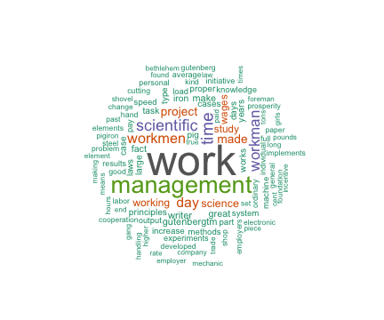

## About _Word Cloud Generator_ App


The key idea about this app is to _upload a text file_ (<500 MB) and quickly generate **word cloud** and **frequency table**. And allow the user to _download_ the generated **word cloud as an image** and the **frequency table as a CSV file**.

In this process, if a user wants to change **minimum frequencies**, **maximum words** to be displayed in the word cloud or tweak the **rotation** of the cloud, user can tweak the same with the _sliders_ provided for each of these.  

This app has 3 tabs. **First tab** generates word cloud. **Second tab** gives more info about this project. **Third tab** is _another app_, just for _demo purpose_ of **network d3** displayed.

**The following 3 slides would display:**  
1. Sample of Word cloud gen: the plot and the table.  
2. Interactive chart with the frequencies of the words.  
3. Future enhancements.  

--- &twocol w1:60% w2:40%

## Word cloud


*** =left


 


```r
library(wordcloud); library(tm)
terms <- word_count(readLines(file))
col <- brewer.pal(8, "Dark2")
wordcloud(names(terms), terms, 
    rot.per = 0.35, colors = col)
```

*** =right

### Top 7 frequencies table


```r
library(xtable)
options(xtable.type='html')
words <- data.frame(freq=terms) 
freq <- head(words, n=7)
xtable(freq)
```

<!-- html table generated in R 3.2.2 by xtable 1.8-0 package -->
<!-- Mon Nov 16 23:14:03 2015 -->
<table border=1>
<tr> <th>  </th> <th> freq </th>  </tr>
  <tr> <td align="right"> work </td> <td align="right"> 470.00 </td> </tr>
  <tr> <td align="right"> management </td> <td align="right"> 237.00 </td> </tr>
  <tr> <td align="right"> time </td> <td align="right"> 147.00 </td> </tr>
  <tr> <td align="right"> scientific </td> <td align="right"> 135.00 </td> </tr>
  <tr> <td align="right"> workman </td> <td align="right"> 123.00 </td> </tr>
  <tr> <td align="right"> workmen </td> <td align="right"> 115.00 </td> </tr>
  <tr> <td align="right"> day </td> <td align="right"> 109.00 </td> </tr>
   </table>

--- .class #id2

## An analysis of top 7 frequencies


```r
library(rCharts)
#grp: words starting alphabet. 1 -> a-e;  2 -> f-j;  3 -> k-o;  4 -> p-t;  5 -> u-z
n1 <- nPlot(freq ~ grp, group = 'wrds', type = 'multiBarChart', data = t1[1:7,])
n1$print('chart')
```
#### NOTE: Issue with rCharts in slidify, overlap of options and legends. To solve, click **stacked** radio button.  

<div id = 'chart' class = 'rChart nvd3'></div>
<script type='text/javascript'>
 $(document).ready(function(){
      drawchart()
    });
    function drawchart(){  
      var opts = {
 "dom": "chart",
"width":    800,
"height":    400,
"x": "grp",
"y": "freq",
"group": "wrds",
"type": "multiBarChart",
"id": "chart" 
},
        data = [
 {
 "wrds": "work",
"freq":            470,
"grp":              5 
},
{
 "wrds": "management",
"freq":            237,
"grp":              3 
},
{
 "wrds": "time",
"freq":            147,
"grp":              4 
},
{
 "wrds": "scientific",
"freq":            135,
"grp":              4 
},
{
 "wrds": "workman",
"freq":            123,
"grp":              5 
},
{
 "wrds": "workmen",
"freq":            115,
"grp":              5 
},
{
 "wrds": "day",
"freq":            109,
"grp":              1 
} 
]
  
      if(!(opts.type==="pieChart" || opts.type==="sparklinePlus" || opts.type==="bulletChart")) {
        var data = d3.nest()
          .key(function(d){
            //return opts.group === undefined ? 'main' : d[opts.group]
            //instead of main would think a better default is opts.x
            return opts.group === undefined ? opts.y : d[opts.group];
          })
          .entries(data);
      }
      
      if (opts.disabled != undefined){
        data.map(function(d, i){
          d.disabled = opts.disabled[i]
        })
      }
      
      nv.addGraph(function() {
        var chart = nv.models[opts.type]()
          .width(opts.width)
          .height(opts.height)
          
        if (opts.type != "bulletChart"){
          chart
            .x(function(d) { return d[opts.x] })
            .y(function(d) { return d[opts.y] })
        }
          
         
        
          
        

        
        
        
      
       d3.select("#" + opts.id)
        .append('svg')
        .datum(data)
        .transition().duration(500)
        .call(chart);

       nv.utils.windowResize(chart.update);
       return chart;
      });
    };
</script>

--- .class #id3

## Future Enhancements

1. We can extend this to spam classification, do a word cloud for spam and ham clouds.  
2. Fix the limitations listed.  
3. We can further extend word cloud to metadata and tags and project word cloud accordingly.
4. There are some apps which analyses twitter data, can dive deeper into this as well.
5. We can extend this by grouping words, different search terms and tags, and build a new model.


